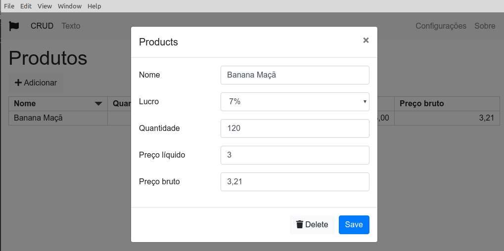

# electron-crud-bs
Projeto inicial: CRUD com Electron, JSON e Bootstrap 4



## Executável do aplicativo

Mais por curiosidade estou incluindo o executável deste aplicativo, mas somente a versão para Linux

Na pasta release-builds/electron-crud-bs-linux-x64, apenas clique no arquivo

electron-crud-bs

Que ele abrirá a janela do aplicativo,  mas não no navegador e sim como um aplicativo desktop.

## Sobre

Um projeto inicial para mostrar como ter o [Electron](https://electronjs.org/) e Bootstrap 4 rodando juntos. 

### Features
- Bootstrap 4
- ES6
- Components architecture
- Simple reactive behaviour (without React, Angular etc.)
- Font-Awesome 5 integration
- CRUD example with JSON storage in file
- Settings component with persistent storage

## Instalação e execução

Clonar o o fonte e executar:

```npm install```

## Running

```npm start```

## If recommended

```npm audit fix```


